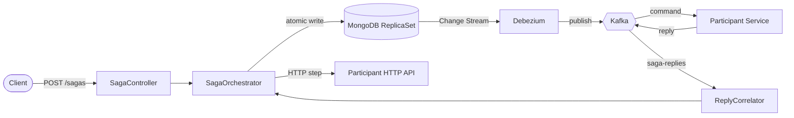

# Saga Orchestration Engine

> A MongoDB-native saga orchestration engine for Spring Boot teams who want operational simplicity over framework breadth.

Coordinates distributed transactions across microservices as long-running state machines defined in YAML — runs each step, persists checkpoints, compensates in strict reverse order on failure. Built around a transactional outbox (no dual-write problem), an explicit business-vs-technical failure protocol, and an event store you can replay.

---

## Quickstart (5 minutes)

```bash
git clone <this-repo> saga-orchestration-engine
cd saga-orchestration-engine
docker compose up -d
./gradlew :saga-orchestrator-example:bootRun
```

**Trigger a saga:**

```bash
curl -X POST http://localhost:8080/sagas \
  -H 'Content-Type: application/json' \
  -d '{
    "sagaType": "order-placement-saga",
    "payload": {"orderId": "ORD-001", "amount": 100},
    "idempotencyKey": "demo-1"
  }'
```

**Observe:**

- Saga state + timeline: `curl http://localhost:8080/sagas/<sagaId>`
- Metrics: <http://localhost:9090> (Prometheus)
- Dashboard: <http://localhost:3000> → *Saga Orchestrator — Overview*

---

## What's in the box

| Concern | Solution |
|---|---|
| Multi-service consistency | Saga orchestrator with strict reverse-order compensation |
| Dual-write problem | Transactional outbox in MongoDB + Debezium → Kafka |
| Failure semantics | **BTFC** — business failures compensate immediately; technical failures retry → DLT → suspend. The two paths never cross. |
| Definition format | YAML loaded from `classpath:sagas/*.yml` |
| Step types | `KAFKA` (async, reply-driven) and `HTTP` (sync) |
| Idempotency | Deterministic hash key + MongoDB unique index; duplicate triggers return the existing saga |
| Aggregate locking | Optional per-saga lock so two sagas can't act on the same business entity |
| Schema evolution | Mongock versioned migrations; engine refuses to start on a failed migration |
| Audit & replay | Append-only event store; reconstruct a saga's state at any point, or replay it against a new definition |
| Observability | Per-saga-type tagged Micrometer metrics + a pre-built Grafana dashboard |

---

## Architecture at a glance



The orchestrator persists each state transition to MongoDB inside a multi-document transaction; outbound commands are written to an outbox collection in the *same* transaction. Debezium tails that collection via Change Streams and publishes to Kafka — so a step is never published without its state change being durable, and vice versa. Participants consume `{module}-commands` topics and reply on a single `saga-replies` topic partitioned by `sagaId`.

---

## Design decisions

A few choices worth calling out, and why:

- **MongoDB ReplicaSet, not Postgres.** Multi-document transactions + Change Streams in one product. The whole outbox-without-dual-write story rests on writing business data and the outbox entry in a single transaction, then letting CDC publish.
- **BTFC failure classification.** Participants tag every failure as `BUSINESS` (the operation can't succeed — card declined; don't retry, compensate) or `TECHNICAL` (infrastructure blip — DB down; retry, then suspend). A naive engine retries everything or compensates everything; BTFC routes each correctly and never crosses the streams.
- **YAML definitions, not a Java DSL.** Sagas are reviewable as configuration by ops/QA, decoupled from compilation, validated at startup.
- **Two artifacts: engine core + participant SDK.** Participants depend only on the thin SDK (annotations + command/reply contracts), never on engine internals — the architectural boundary is structural, not by convention.
- **Single `saga-replies` topic, partitioned by `sagaId`.** New participants need no orchestrator change; same-saga replies land on the same partition, keeping step processing sequential.
- **Suspend, don't guess.** A saga whose technical retries exhaust goes to `SUSPENDED` and waits for an operator decision (retry / compensate) — it is never auto-compensated. Non-critical steps may instead declare a fallback value to continue.
- **Event store + replay.** Every transition is appended to an immutable, snapshot-bearing event log. You can reconstruct a saga's exact state at any point in its history, or replay a historical saga against a *new* definition to see how today's YAML would have handled it — before deploying.

---

## Tech stack

Java 17 · Spring Boot 3.2 · MongoDB 7.0 ReplicaSet · Apache Kafka · Debezium CDC · Mongock · Micrometer (Prometheus) · Gradle · Docker.

---

## Project layout

```
saga-orchestrator-core/     the engine — state machine, outbox, executors, schedulers, REST API
saga-orchestrator-sdk/      participant library — @SagaCommandHandler, command/reply contracts
saga-orchestrator-example/  runnable order-placement showcase (Kafka + HTTP steps)
```

---

## Status

Single-instance, production-shaped, integration-tested against real MongoDB + Kafka (Testcontainers). Multi-instance high-availability is a future direction, not a current claim.

---

## License

Personal project. Licensing TBD.
