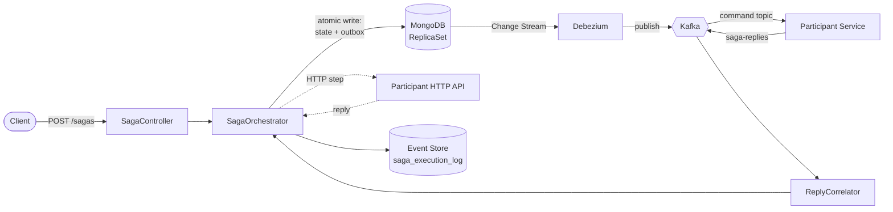
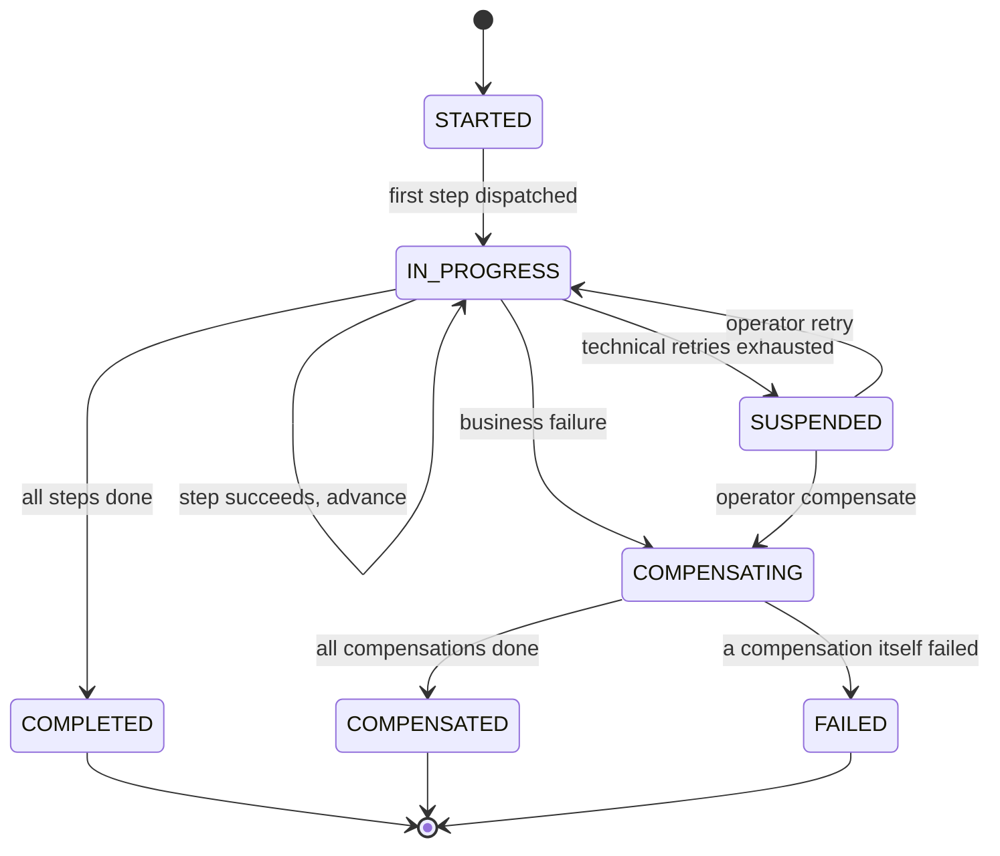
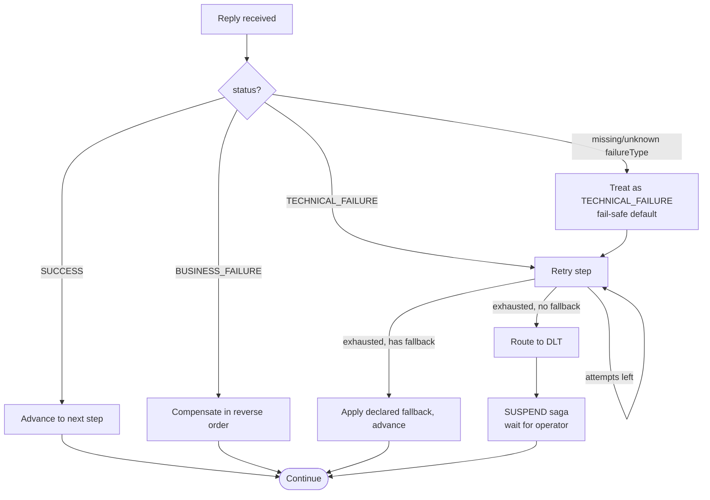

# Saga Orchestration Engine

> A MongoDB-native saga orchestrator for Spring Boot — durable distributed transactions defined in YAML, with a wire-level protocol that keeps business and technical failures on separate rails.

Most saga libraries do one of two things wrong. They retry everything (so a declined credit card gets hammered five times before compensating), or they compensate everything (so a transient DB blip burns down a half-completed order). This engine refuses to do either: every failure is classified at the participant, routed deterministically by the orchestrator, and **the two paths never cross**.

That single discipline — formalised here as the **BTFC** protocol — is the spine of the engine. Everything else (transactional outbox, event-sourced replay, YAML definitions, two-artifact SDK split) is in service of it.

---

## Table of contents

- [What's in the box](#whats-in-the-box)
- [Quickstart (5 minutes)](#quickstart-5-minutes)
- [Architecture at a glance](#architecture-at-a-glance)
- [Saga lifecycle](#saga-lifecycle)
- [The BTFC failure protocol](#the-btfc-failure-protocol)
- [Design decisions](#design-decisions)
- [Defining a saga](#defining-a-saga)
- [Writing a participant](#writing-a-participant)
- [Operating a saga](#operating-a-saga)
- [Event store and replay](#event-store-and-replay)
- [Observability](#observability)
- [Tech stack](#tech-stack)
- [Project layout](#project-layout)
- [Status](#status)
- [License](#license)

---

## What's in the box

| Concern | How it's solved |
|---|---|
| Multi-service consistency | Saga orchestrator with strict reverse-order compensation |
| Dual-write problem | Transactional outbox in MongoDB + Debezium CDC → Kafka |
| Failure semantics | **BTFC** — business failures compensate immediately; technical failures retry → DLT → suspend. The two paths never cross. |
| Definition format | YAML loaded from `classpath:sagas/*.yml`, validated at startup |
| Step transports | `KAFKA` (async, reply-driven) and `HTTP` (sync request/response) |
| Idempotency | Deterministic hash key + unique MongoDB index; duplicate triggers return the existing saga |
| Aggregate locking | Optional per-business-entity lock so two sagas can't race on the same order/account |
| Step-level fallback | Non-critical step can declare a default value to continue past technical failure |
| Schema evolution | Mongock versioned migrations; engine refuses to start on a failed migration |
| Audit & replay | Append-only event store with per-event snapshots; reconstruct any saga's state, or replay against a new definition |
| Observability | Per-saga-type tagged Micrometer metrics + a pre-built Grafana dashboard |

---

## Quickstart (5 minutes)

**Requirements:** Docker, Java 17, free ports 8080 / 9090 / 3000.

```bash
git clone <this-repo> saga-orchestration-engine
cd saga-orchestration-engine
docker compose up -d        # MongoDB ReplicaSet, Kafka, Debezium, Prometheus, Grafana
./gradlew :saga-orchestrator-example:bootRun
```

**Trigger a saga:**

```bash
curl -X POST http://localhost:8080/sagas \
  -H 'Content-Type: application/json' \
  -d '{
    "sagaType": "order-placement-saga",
    "payload": {"orderId": "ORD-001", "amount": 100},
    "idempotencyKey": "demo-1"
  }'
```

**Observe:**

| Surface | Where |
|---|---|
| Saga state + timeline | `GET http://localhost:8080/sagas/<sagaId>` |
| Step-by-step event log | `GET http://localhost:8080/sagas/<sagaId>/events` |
| Prometheus metrics | <http://localhost:9090> |
| Grafana dashboard | <http://localhost:3000> → *Saga Orchestrator — Overview* |

**Try a business failure.** Set `amount` to a value the example's `PaymentController` rejects (it has a hard-coded "declined over 9999" rule). Watch the saga transition `IN_PROGRESS → COMPENSATING → COMPENSATED` — inventory reservation released, payment never charged.

**Try a technical failure.** Kill Kafka mid-flight (`docker compose stop kafka` after the first step succeeds). Retries exhaust → message routes to DLT → saga transitions to `SUSPENDED`, *not* `COMPENSATED`. Restart Kafka, hit `POST /sagas/<sagaId>/retry`, the saga resumes from where it stopped.

---

## Architecture at a glance



The orchestrator persists every state transition to MongoDB inside a **multi-document transaction**. Outbound commands are written to an outbox collection in the *same* transaction. Debezium tails that collection via MongoDB Change Streams and publishes to Kafka — so a step is never published without its state change being durable, and a state change is never durable without its step being publishable. **There is no dual-write in application code.**

Participants consume `{module}-commands` topics and reply on a single `saga-replies` topic partitioned by `sagaId`. Same-saga replies always land on the same partition, keeping step processing sequential per instance.

---

## Saga lifecycle



Two things to note about this state machine:

1. **`SUSPENDED` is not `FAILED`.** A suspended saga is paused, not dead. The engine never auto-resolves it — only an operator decision (retry / compensate) moves it forward.
2. **`FAILED` is reserved for compensation failures only.** If forward execution fails, the engine compensates. If compensation itself fails, *then* the saga is `FAILED` — and at that point, human intervention is the only honest path.

---

## The BTFC failure protocol

**BTFC — Business + Technical Failure Classification.** A wire-level contract between the orchestrator and its participants. Specified independently of the engine (versioned, RFC-2119 wording, conformance-tested) so any future orchestrator implementation can be BTFC-compliant.

### The contract

Every reply from a participant carries a `status` and, on failure, a `failureType`:

```json
// Success
{ "sagaId": "...", "stepId": "charge-payment", "status": "SUCCESS",
  "failureType": null, "data": { "chargeId": "ch_42" } }

// Business failure — the operation cannot succeed under this input
{ "sagaId": "...", "stepId": "charge-payment", "status": "BUSINESS_FAILURE",
  "failureType": "BUSINESS", "error": "CARD_DECLINED" }

// Technical failure — the operation could succeed, infrastructure broke
{ "sagaId": "...", "stepId": "charge-payment", "status": "TECHNICAL_FAILURE",
  "failureType": "TECHNICAL", "error": "Database timeout" }
```

### How the orchestrator routes each



### Why this matters

Most saga frameworks let the orchestrator *guess* what to do with a failure — usually by retrying everything by default. That produces two real, expensive bugs in production:

- **Compensating a transient blip.** A 500-ms network glitch causes a perfectly-good inventory reservation to be released, then re-reserved on retry. Customer sees flicker, ops sees noise, finance sees double-counting in audit.
- **Retrying a hard "no."** A `CARD_DECLINED` reply gets retried five times because the engine can't tell it apart from a timeout. Customer's bank flags the merchant. Compensation eventually runs, but late.

BTFC eliminates both by making the participant declare its intent. The orchestrator never guesses. The two failure paths share no code.

### The fallback escape hatch

A step's YAML may declare a `fallback` value. If the step is non-critical and technical retries exhaust, the orchestrator applies the fallback as the step result and advances — the saga continues to `COMPLETED` rather than `SUSPENDED`. Crucially, **fallback fires only on technical failure**; a business failure always compensates. This is the one place "soft" continuation is allowed, and it's explicit at definition time, not implicit at runtime.

---

## Design decisions

A few choices worth calling out, and the alternatives they were chosen over:

### MongoDB ReplicaSet, not Postgres

Postgres + a CDC tool would work. MongoDB earns the slot because **multi-document transactions and Change Streams ship in one product**. The whole outbox-without-dual-write story rests on writing business data and the outbox entry in a *single* transaction, then letting CDC publish from there. With Postgres you'd bolt on Debezium against the WAL; with MongoDB you bolt on Debezium against Change Streams. Same story, fewer moving parts.

### Two artifacts: engine core + participant SDK

Participants depend only on the thin SDK (annotations, command/reply contracts, exception types). They never see engine internals. The architectural boundary between orchestrator and participants is **structural** — enforced by the module graph — not by convention. A participant cannot accidentally call into `SagaOrchestrator` because its classpath doesn't have it.

### YAML definitions, not a Java DSL

A Java DSL gives compile-time safety. YAML gives:

- Reviewability by ops and QA without a JVM
- Decoupling from engine release cycles — definitions evolve independently
- Validation at startup, with a clear failure if a step's `compensationAction` or `module` is wrong

The validator runs before the application context is fully built, so a bad definition fails fast rather than at first trigger.

### Single `saga-replies` topic, partitioned by `sagaId`

Two alternatives were considered: one reply topic per participant, or one per saga type. Both require an orchestrator change every time a new participant joins. A single `saga-replies` topic, partitioned by `sagaId`, gives:

- Zero orchestrator change when a new participant ships
- Same-saga replies always land on the same partition → sequential per-saga step processing
- Trivial scaling: add partitions, add consumers

### Suspend, don't guess

When technical retries exhaust, the saga goes to `SUSPENDED` and waits for a human. It is **never auto-compensated**. The alternative — auto-compensate on retry exhaustion — sounds tidy until production: a 5-minute database outage compensates every in-flight order, customers lose half-completed work, and the operator now has to *un-compensate*, which isn't a thing. Suspension is the conservative default. The fallback mechanism is the explicit opt-in to "yes, continue past this."

### Event store with snapshots, not just current state

Every transition is appended to `saga_execution_log` with a per-event snapshot of the saga's state at that point. Two capabilities fall out:

- **Reconstruction.** You can rebuild a saga's exact state at any prior point in its life. Useful for debugging "what did this look like 3 hours ago?"
- **Replay against new definitions.** A historical saga's recorded inputs can be replayed against today's YAML in a sandboxed in-memory executor to see how the new definition *would have* handled it — before deploying.

The trade is storage: each transition writes a row. For the scale this engine targets (enterprise sweet spot, not hyperscale), the storage cost is dwarfed by the operational value.

---

## Defining a saga

A saga is a single YAML file in `classpath:sagas/`:

```yaml
name: order-placement-saga
timeoutMinutes: 30
lockTargetType: order      # optional: only one saga per orderId at a time
lockTargetField: orderId

steps:
  - name: reserve-inventory
    type: KAFKA
    module: inventory
    action: RESERVE_INVENTORY
    compensationAction: RELEASE_INVENTORY
    retryMaxAttempts: 3
    timeoutSeconds: 30

  - name: charge-payment
    type: HTTP
    action: CHARGE_PAYMENT
    url: http://payments.svc/charge
    compensationAction: REFUND_PAYMENT
    compensationUrl: http://payments.svc/refund
    retryMaxAttempts: 2
    timeoutSeconds: 10

  - name: schedule-shipment
    type: KAFKA
    module: shipment
    action: SCHEDULE_SHIPMENT
    compensationAction: CANCEL_SHIPMENT
    retryMaxAttempts: 3
    timeoutSeconds: 30
    fallback:                # optional: continue past technical failure
      shipmentId: "PENDING"
      eta: "unknown"

  - name: confirm-order
    type: KAFKA
    module: order
    action: CONFIRM_ORDER
    # No compensationAction — terminal notification step
    retryMaxAttempts: 3
    timeoutSeconds: 30
```

What the validator checks at startup:

- Every non-terminal step has a `compensationAction` (or is explicitly marked terminal)
- `KAFKA` steps have a `module`; `HTTP` steps have a `url`
- Step names are unique within the saga
- Retry counts and timeouts are non-negative
- `fallback`, if present, is a JSON-serialisable value

A failed validation aborts startup — the engine refuses to run with a broken definition.

---

## Writing a participant

Participants depend on `saga-orchestrator-sdk`. Two patterns, one per transport:

**Kafka participant** — handler discovered by annotation, command/reply contract enforced by the SDK:

```java
@SagaParticipant(module = "inventory")
@Component
public class InventoryHandler {

    @SagaCommandHandler(action = "RESERVE_INVENTORY")
    public SagaReply reserve(SagaCommand command) {
        var req = command.payloadAs(ReserveRequest.class);

        try {
            var reservationId = inventoryService.reserve(req.sku(), req.qty());
            return SagaReply.success(command, Map.of("reservationId", reservationId));

        } catch (OutOfStockException e) {
            return SagaReply.businessFailure(command, "OUT_OF_STOCK", e.getMessage());

        } catch (DataAccessException e) {
            return SagaReply.technicalFailure(command, "DB_UNAVAILABLE", e.getMessage());
        }
    }

    @SagaCommandHandler(action = "RELEASE_INVENTORY")
    public SagaReply release(SagaCommand command) { /* compensation */ }
}
```

**HTTP participant** — just a Spring `@RestController` accepting and returning the SDK's command/reply types:

```java
@RestController
@RequestMapping("/payment")
public class PaymentController {

    @PostMapping("/charge")
    public ResponseEntity<SagaHttpReply> charge(@RequestBody SagaHttpCommand command) {
        var req = command.payloadAs(ChargeRequest.class);

        if (req.amount() > 9999) {
            return ResponseEntity.ok(SagaHttpReply.businessFailure(
                command, "AMOUNT_TOO_HIGH", "Exceeds per-txn cap"));
        }

        var chargeId = paymentGateway.charge(req);
        return ResponseEntity.ok(SagaHttpReply.success(
            command, Map.of("chargeId", chargeId)));
    }
}
```

The SDK's `SagaReply.success(...)` / `businessFailure(...)` / `technicalFailure(...)` factories produce BTFC-compliant payloads. A conformance test in the SDK validates the factories against the BTFC v1 spec on every build — so the contract is enforced at the library level, not by participant convention.

---

## Operating a saga

| Endpoint | Purpose |
|---|---|
| `POST /sagas` | Trigger a new saga (idempotent by `idempotencyKey`) |
| `GET /sagas` | List all sagas; optional `?status=SUSPENDED` (or any state) filter |
| `GET /sagas/{sagaId}` | Current state, step timeline, and — when the saga needs operator attention — an embedded `diagnosis` block (root cause + suggested action) |
| `GET /sagas/{sagaId}/events` | Ordered, immutable event stream from the event store |
| `POST /sagas/{sagaId}/replay` | Reconstruct state from the event log. Optional `?upTo=<ISO-8601 instant>` for point-in-time reconstruction. Works even if the live `SagaInstance` row is gone — state is derivable from events alone. |
| `POST /sagas/{sagaId}/retry` | Resume a `SUSPENDED` saga from its last step |
| `POST /sagas/{sagaId}/compensate` | Force-compensate a `SUSPENDED` saga |
| `POST /sagas/{sagaId}/replay-definition` | Replay this saga's recorded inputs against the current definition on disk (see below) |
| `POST /sagas/replay-definition/bulk` | Same, across a window of historical sagas |
| `GET /saga-definitions` | Loaded definitions — used by participants on startup to verify their module/action set matches |

`POST /sagas/{sagaId}/retry` and `POST /sagas/{sagaId}/compensate` are the **only** legal transitions out of `SUSPENDED`. The engine never makes that decision on its own.

---

## Event store and replay

Every state transition writes an event to `saga_execution_log`. Each event carries the *full saga snapshot at that moment* — not just a delta. Two things that gives you:

**1. State reconstruction.** Replay a saga's events through the state machine and you get its exact state at any point in its history. Useful for: debugging an oncall ticket, building a `/timeline` UI without an extra cache, building per-step diff views.

**2. Definition replay.** A historical saga's recorded *inputs* (the original payload and each reply received) can be fed into a sandboxed in-memory executor running today's YAML definition. The output is a `ReplayReport` showing how today's definition would have handled yesterday's saga — would it have suspended where the original compensated? Would the new fallback have rescued it? **You can test a definition change against a year of real production traffic before merging it.** No mocks, no synthetic data.

```bash
# Replay saga 8c2b... against the definition currently on disk
curl -X POST http://localhost:8080/sagas/8c2b.../replay-definition

# Bulk replay every saga from the last 24h against a candidate definition
curl -X POST http://localhost:8080/sagas/replay-definition/bulk \
  -d '{"definitionName": "order-placement-saga", "since": "P1D"}'
```

---

## Observability

All metrics are exported through Micrometer. Lifecycle counters are intentionally **separate per terminal outcome** (rather than one counter with an `outcome` tag) so dashboards can graph each rate cleanly without a label filter.

| Metric | Type | Tags |
|---|---|---|
| `saga.started` / `saga.completed` / `saga.compensated` / `saga.suspended` / `saga.failed` | counter | `sagaType` |
| `saga.duration` | timer | `sagaType` |
| `saga.step.executed` | counter | `sagaType`, `stepName` |
| `saga.step.failed` | counter | `sagaType`, `stepName`, `failureType` (`BUSINESS` / `TECHNICAL`) |
| `saga.step.fallback.applied` | counter | `sagaType`, `stepName` |
| `saga.reply.late` | counter | `terminalStatus` (saga's state when the late reply arrived) |
| `saga.reply.unknown` | counter | — (replies for non-existent sagaIds) |
| `saga.reply.throttled` | counter | — (replies dropped by the per-sagaId rate limiter) |
| `saga.outbox.publisher.mode` | gauge | — (which publisher mode is active) |
| `saga.outbox.publish.failed` | counter | — |
| `saga.outbox.max.retry.count` | gauge | — (worst-case outbox entry retry depth — early warning for stuck publishes) |

**Bounded label cardinality.** The `sagaType` tag is the canonical Prometheus footgun: a runaway producer can emit unbounded distinct values and bloat the metric store. `SagaMetrics` caps the distinct set (default 100, configurable via `saga.metrics.max-tag-cardinality`); past the cap, new types fold into a literal `OTHER` bucket. The cap is observable in code, not just policy.

The bundled Grafana dashboard (auto-provisioned via `docker compose`) graphs:

- Saga rates by outcome — started, completed, compensated, suspended, failed
- Saga duration distribution (p50 / p95 / p99)
- Step failure rate split by `failureType` — business vs technical separately
- Fallback application rate — non-zero means a non-critical step is degrading
- Reply-side health — late, unknown, and throttled reply counts
- Outbox health — publish failures and worst-case retry depth

Logs are structured (JSON) and carry `sagaId` on every line for trivial correlation across orchestrator, participants, and Debezium.

---

## Tech stack

Java 17 · Spring Boot 3.2 · MongoDB 7.0 ReplicaSet · Apache Kafka · Debezium CDC · Mongock · Micrometer (Prometheus) · Grafana · Gradle · Docker.

---

## Project layout

```
saga-orchestrator-core/      the engine — state machine, outbox, executors,
                             schedulers, REST API, event store, replay
saga-orchestrator-sdk/       participant library — @SagaCommandHandler,
                             SagaCommand/SagaReply contracts, FailureType
saga-orchestrator-example/   runnable order-placement showcase — Kafka and
                             HTTP steps, a YAML definition, all four
                             participants (inventory, payment, shipment, order)
dashboards/grafana/          provisioned dashboard JSON
docker/                      docker-compose setup for MongoDB RS, Kafka,
                             Debezium, Prometheus, Grafana
```

---

## Status

Single-instance, production-shaped, integration-tested against real MongoDB and Kafka via Testcontainers. The example application is the canonical end-to-end demo — start it, trigger a saga, watch every state transition through Grafana.

Multi-instance high-availability (leader election for schedulers, partitioned outbox polling) is a designed-but-not-built direction. The persistence layer and state machine were built to accommodate it; the orchestration loop currently assumes single-writer.

---

## License

Personal project. Licensing TBD.
